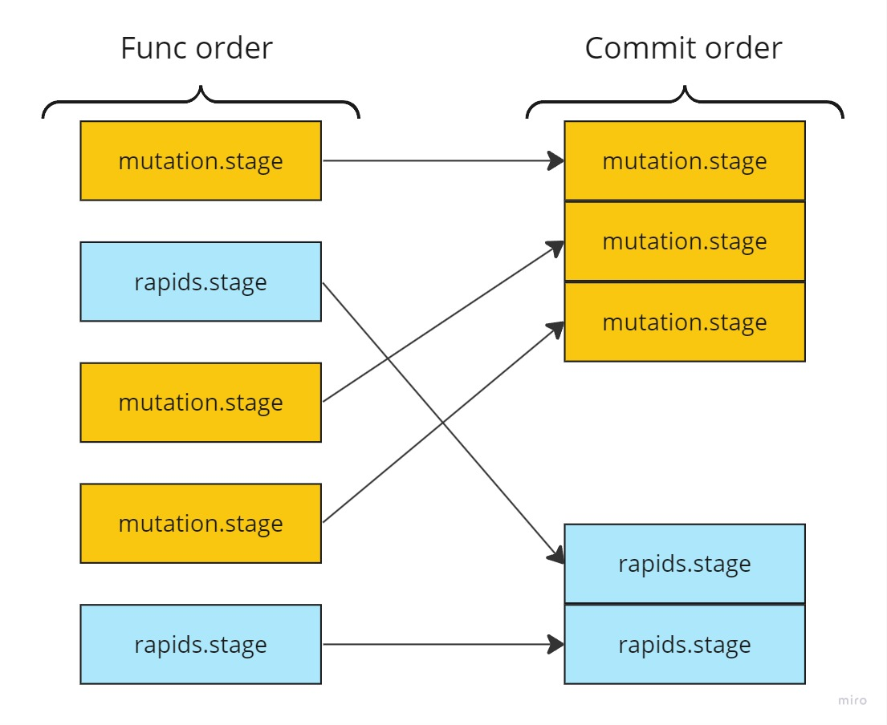

# with-iota

## Getting started

1. Run `npm install @1mill/with-iota`
1. Configure your AWS Lambda handler

    ```node
    import { CREATE, DELETE, INCREMENT, SET, withIota } from '@1mill/with-iota'

    const func = async ({ cloudevent, ctx, data, mutation, rapids }) => {
      const { companyId, name } = data

      if (!companyId) { throw new Error('companyId is required') }
      if (!name) { throw new Error('name is required') }

      // * Create some record
      const { id } = mutation.stage({
        action: CREATE,
        props: { companyId, name, comment: 'Hello world!' },
        type: 'myRecords',
      })

      // * Enqueue cloudevent that will be emitted after all staged mutations
      // * are comitted.
      rapids.stage({
        data: { id },
        type: 'fct.my-record-created.v0',
      })

      // * Increment some value on a different record
      mutation.stage({
        action: INCREMENT,
        id: companyId,
        props: { recordsCount: 1 },
        type: 'companies',
      })

      // * Set a value on the record we just created
      mutation.stage({
        action: SET,
        id,
        props: { comment: 'Update this comment!' },
        type: 'myRecords'
      })

      // * Selete the record we just created
      mutation.stage({
        action: DELETE,
        id,
        type: 'myRecords',
      })

      // * Enqueue another cloudevent that will be emitted after all
      // * staged mutations are committed.
      rapids.stage({
        data: { id },
        type: 'fct.my-record-deleted.v0',
      })

      // * Return some value for calls with InvocationType set to RequestResponse.
      return cloudevent.id
    }

    export const handler = async (event, ctx) => await withIota(event, ctx, { func })
    ```

## Usage

### Setup

**If you ever change any of the values below once they are set, be sure to migrate any saved journal entries to the new settings. If you do not do this, then already processed cloudevents may run again.**

| Environment                       | Required | Types  | Default              | Description                                            |
|-----------------------------------|----------|--------|----------------------|--------------------------------------------------------|
| `MILL_IOTA_AWS_ACCESS_KEY_ID`     | yes      | string |                      | AWS Access Key with permissions to AWS EventBridge.    |
| `MILL_IOTA_AWS_ENDPOINT`          |          | string | Set by AWS           |                                                        |
| `MILL_IOTA_AWS_REGION`            | yes      | string |                      | Valid AWS Region.                                      |
| `MILL_IOTA_AWS_SECRET_ACCESS_KEY` | yes      | string |                      | AWS Secret Key with permissions to AWS EventBridge.    |
| `MILL_IOTA_AWS_SESSION_TOKEN`     |          | string | Set by AWS           | AWS Session Token with permissions to AWS EventBridge. |
| `MILL_IOTA_EVENTBUS_NAME`         |          | string | `default`            | Name of the AWS EventBridge.                           |
| `MILL_IOTA_JOURNAL_NAME`          |          | string | `iotaJournalEntries` | Name of the MongoDB collection.                        |
| `MILL_IOTA_MONGO_DB`              | yes      | string |                      | Name of the MongoDB Database.                          |
| `MILL_IOTA_MONGO_URI`             | yes      | string |                      | URI of the MongoDB Cluster.                            |
| `MILL_IOTA_SERVICE_ID`            | yes      | string |                      | Unique name of the service / application itself.       |

During the AWS Lambda runtime, AWS automatically provides all the `MILL_IOTA_AWS_` credentials.

### Func

| Property                   | Type      |Description |
|----------------------------|-----------|------------|
| cloudevent                 | object    | The `cloudevent` payload from `event`. |
| countDocuments(name, args) | function  | Alias for `db.collection(name).countDocuments(args)` using `mongo`. |
| ctx                        | object    | AWS Lambda `context`. |
| data                       | any       | The `cloudevent.data`. If `cloudevent.datacontenttype` is `application/json`, then the JSON parsed `data` will be returned. |
| distinct(name, args)       | function  | Alias for `db.collection(name).distinct(args)` using `mongo`. |
| event                      | object    | The `event` that invoked the AWS Lambda function. |
| find(name, args)           | function  | Alias for `db.collection(name).find(args)` using `mongo`. |
| findOne(name, args)        | function  | Alias for `db.collection(name).findOne(args)` using `mongo`. |
| mutation.stage(args)       | function  | Stage a mutation to be committed after `return`. |
| rapids.stage(args)         | function  | Stage a cloudevent to be sent to `rapids` after `mutations` are applied. |

## Lifecycle

Despite the straggered nature of staged mutations and staged rapids cloudevents, all mutations are applied first in order. Then, all rapids cloudevents are emitted in order.

| Lifecycle | Commit order |
| --- | --- |
|  |  |

## Development

1. Run `npm install`
1. Create `.env` file with with `MILL_IOTA_AWS_ACCESS_KEY_ID`, `MILL_IOTA_AWS_REGION`, and `MILL_IOTA_AWS_SECRET_ACCESS_KEY`.
1. Run `docker compose up -d mongo mongo-admin`
1. Run `docker compose up test`

## Deploy

1. Run `npm version (major|minor|patch)`
1. Run `git push`
1. Run `npm run deploy`
